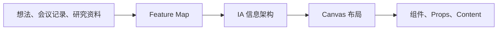
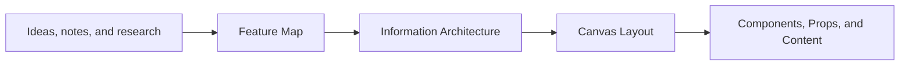

<p align="center">
  
</p>

# 宣

Language / 语言: [中文](#中文) | [English](#english)

> Schema first, then layout. Start with a feature, not a layout.

---

## 中文

「宣」是一个面向产品原型的可视化编辑器和 Codex 插件。它先把模糊想法、会议记录或研究资料整理成 **Feature Map**，再建立信息架构，最后进入 Canvas 完成布局、shadcn/ui 组件绑定和内容意图。

### 工作流



1. **Feature Map**：提炼用户痛点，划分功能模块，列出功能及优先级，保存到 `.xuan/feature-map.md`。
2. **IA**：以思维导图描述页面、区域、导航和语义层级，不提前决定视觉布局。
3. **Canvas**：摆放和缩放节点，绑定 shadcn/ui 组件，填写 Props 与结构化内容意图。

Feature Map 的固定关系是：

```text
用户痛点 → 功能模块 → 功能列表（P0 / P1 / P2）
```

### 主要功能

- IA 思维导图和 Canvas 双视图，共用同一份语义文档。
- 选择、移动、框选和绘制矩形组件。
- 拖动时吸附其他组件或像素网格。
- 显示像素网格并一键让主体视图居中。
- 为节点设置语义角色、形状和页面尺寸。
- 绑定 shadcn/ui 组件，以字段和值编辑 Props 和 Content。
- 预览 Sidebar、表单、数据展示等组件。
- 多页面、导入导出、撤销重做、键盘操作。
- 中英文和 system / light / dark 主题。
- Agent 写入后自动同步到正在运行的编辑器。

### Agent 工作流

仓库内置四个 Skills：

- `xuan-feature-map`：生成或完善 Feature Map。
- `xuan-ia-writer`：只修改节点名称、角色和树结构。
- `xuan-canvas-layout`：只修改布局、组件、Props 和 Content。
- `xuan`：在跨阶段请求中负责路由。

MCP Server 提供四个工具：

- `initialize_xuan_document`
- `get_xuan_document_context`
- `apply_xuan_ia_operations`
- `apply_xuan_canvas_operations`

所有写入都使用 revision 检查、原子批处理和 `clientMutationId` 幂等键。IA 工具不会修改 Canvas 数据，Canvas 工具也不会改变 IA 树。

### Prompt 示例

安装远程插件：

```text
帮我从这个 Git 仓库安装 Xuan Codex plugin：https://github.com/Penn-Lam/xuan。安装后确认 Xuan Skills 和 MCP tools 已注册。
```

加载本地 checkout：

```text
帮我把 xuan/plugins/xuan 作为本地 Codex plugin 加载，并确认 Xuan Skills 和 MCP tools 可用。
```

从会议记录生成 Feature Map：

```text
使用 /xuan-feature-map，把下面的会议记录整理为 Feature Map。按“用户痛点 → 功能模块 → 功能列表”组织，为功能标注 P0/P1/P2，并保存到 .xuan/feature-map.md。

会议记录：
<粘贴内容>
```

根据 Feature Map 建立 IA：

```text
使用 /xuan-ia-writer，读取 .xuan/feature-map.md，为 P0 和 P1 功能建立信息架构。只处理节点名称、语义角色和层级，不做布局或组件绑定。
```

完成 Canvas 布局：

```text
使用 /xuan-canvas-layout，读取当前 IA，完成桌面端布局，绑定合适的 shadcn/ui 组件并填写代表性内容。保留 IA 的名称、角色和层级。
```

执行完整流程：

```text
使用 /xuan 把下面的产品想法做成原型。先生成 Feature Map，再建立 IA，最后完成 Canvas 布局；每个阶段完成后再进入下一阶段。

产品想法：
<粘贴内容>
```

### 数据存储

- Feature Map：`.xuan/feature-map.md`
- 原型文档：`.xuan/document.json`
- 浏览器本地页面状态：`xuan.pages.v1`
- 幂等记录：`.xuan/mutations.json`（运行时文件，不提交）

`.xuan/document.json` 同时是导出格式、文件格式和 Agent 操作格式。节点包含：

```json
{
  "id": "node_search",
  "name": "Global Search",
  "role": "search",
  "rect": { "x": 1000, "y": 18, "w": 280, "h": 36 },
  "shape": "rectangle",
  "component": {
    "ref": "Input",
    "props": { "type": "search" }
  },
  "content": {
    "placeholder": "Search orders, products..."
  },
  "children": []
}
```

### 本地开发

需要 [Bun](https://bun.sh/) 和 Node.js 20.19+。

```bash
bun install
bun run dev
```

打开 <http://localhost:5173>。开发服务器会通过 `/__xuan/document` 在编辑器和 `.xuan/document.json` 之间同步当前文档。

### MCP 配置

Codex 插件位于 `plugins/xuan`。其他支持 stdio MCP 的客户端可以直接配置 Server：

```json
{
  "mcpServers": {
    "xuan": {
      "command": "node",
      "args": ["/你的绝对路径/xuan/plugins/xuan/mcp/server.mjs"]
    }
  }
}
```

调用工具时，`projectPath` 必须指向包含 `.xuan/document.json` 的项目根目录。

### 开发命令

```bash
bun run dev
bun run typecheck
bun run test
bun run build
bun run preview
```

---

## English

Xuan is a visual product-prototyping editor and Codex plugin. It turns vague ideas, meeting notes, or research into a **Feature Map**, builds information architecture next, and only then moves to Canvas for layout, shadcn/ui component binding, and content intent.

### Workflow



1. **Feature Map**: extract user pains, group feature modules, prioritize features, and save the result to `.xuan/feature-map.md`.
2. **IA**: describe pages, regions, navigation, and semantic hierarchy as a mind map without deciding visual layout.
3. **Canvas**: position and resize nodes, bind shadcn/ui components, and add structured props and content intent.

The Feature Map keeps one traceable chain:

```text
User pains → Feature modules → Feature list (P0 / P1 / P2)
```

### Highlights

- IA mind map and Canvas views backed by one semantic document.
- Select, move, marquee-select, and draw rectangle components.
- Snap to components or the pixel grid while dragging.
- Toggle the pixel grid and recenter the main view.
- Assign semantic roles, shapes, and viewport presets.
- Bind shadcn/ui components and edit Props and Content as fields and values.
- Preview Sidebar, form, and data-display components.
- Multiple pages, import/export, undo/redo, and keyboard controls.
- Chinese and English UI with system, light, and dark themes.
- Live synchronization from Agent writes to the running editor.

### Agent workflow

The repository includes four Skills:

- `xuan-feature-map`: create or refine the Feature Map.
- `xuan-ia-writer`: change only node names, roles, and tree structure.
- `xuan-canvas-layout`: change only layout, components, props, and content.
- `xuan`: route requests that span multiple stages.

The MCP Server exposes four tools:

- `initialize_xuan_document`
- `get_xuan_document_context`
- `apply_xuan_ia_operations`
- `apply_xuan_canvas_operations`

Writes use revision checks, atomic batches, and idempotent `clientMutationId` values. IA tools cannot change Canvas data, and Canvas tools cannot change the IA tree.

### Prompt examples

Install the remote plugin:

```text
Install the Xuan Codex plugin from this Git repository: https://github.com/Penn-Lam/xuan. Then verify that the Xuan Skills and MCP tools are registered.
```

Load a local checkout:

```text
Load xuan/plugins/xuan as a local Codex plugin, then verify that the Xuan Skills and MCP tools are available.
```

Create a Feature Map from meeting notes:

```text
Use /xuan-feature-map to turn the meeting notes below into a Feature Map. Organize it as “User pains → Feature modules → Feature list,” assign P0/P1/P2 priorities, and save it to .xuan/feature-map.md.

Meeting notes:
<paste content>
```

Build IA from the Feature Map:

```text
Use /xuan-ia-writer to read .xuan/feature-map.md and build information architecture for the P0 and P1 features. Change only node names, semantic roles, and hierarchy; do not create layout or component bindings.
```

Lay out the Canvas:

```text
Use /xuan-canvas-layout to read the current IA, create the desktop layout, bind suitable shadcn/ui components, and add representative content. Preserve IA names, roles, and hierarchy.
```

Run the complete workflow:

```text
Use /xuan to turn the product idea below into a prototype. Create the Feature Map first, build IA second, and complete the Canvas layout last. Finish each stage before moving to the next.

Product idea:
<paste content>
```

### Storage

- Feature Map: `.xuan/feature-map.md`
- Prototype document: `.xuan/document.json`
- Browser page state: `xuan.pages.v1`
- Idempotency log: `.xuan/mutations.json` (runtime only)

`.xuan/document.json` is the export format, file format, and Agent operation format.

### Local development

Requires [Bun](https://bun.sh/) and Node.js 20.19+.

```bash
bun install
bun run dev
```

Open <http://localhost:5173>. The development server synchronizes the editor and `.xuan/document.json` through `/__xuan/document`.

### MCP configuration

The Codex plugin lives in `plugins/xuan`. Other stdio MCP clients can configure the Server directly:

```json
{
  "mcpServers": {
    "xuan": {
      "command": "node",
      "args": ["/absolute/path/to/xuan/plugins/xuan/mcp/server.mjs"]
    }
  }
}
```

For every tool call, `projectPath` must point to the project root containing `.xuan/document.json`.

### Development commands

```bash
bun run dev
bun run typecheck
bun run test
bun run build
bun run preview
```
